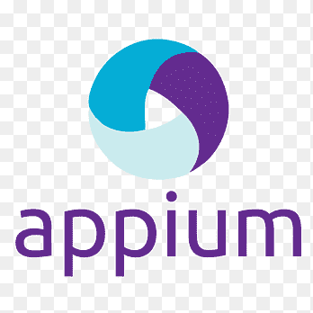
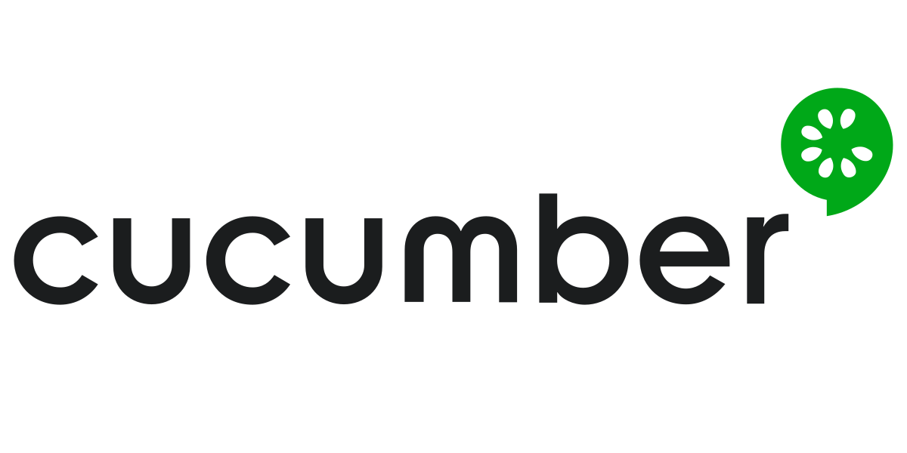
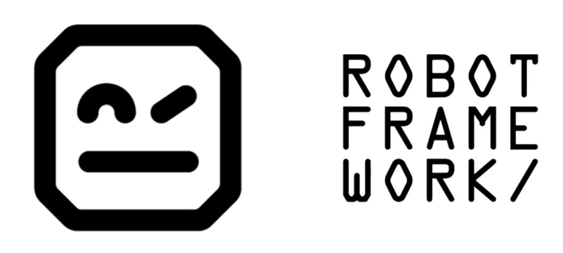

### Hi there 👋

## <h3>I am Afsar, Passionate Software QA and Developer.</h3>
 

# <h2>My Youtube videos </h2>
<!-- BLOG-POST-LIST:START -->
<!-- BLOG-POST-LIST:END -->

<h2 align="center">🔥 Languages & Frameworks & Tools & Abilities 🔥</h2>
 

  <code></code>
<code></code>
<code></code>
<code></code>
<code></code>
<code></code>
<code></code>
<code></code>
<code></code>
<code></code>
<code></code>
<code></code>
<code></code>
  <code></code>
  <code></code>
  <code></code>
  <code></code>
  <code></code>
  <code></code>
  <code></code>
  <code></code>
  <code></code>
  <code></code>
  <code></code>
  <code></code>
  <code></code>
  <code></code>
  <code></code>
  <code></code>

